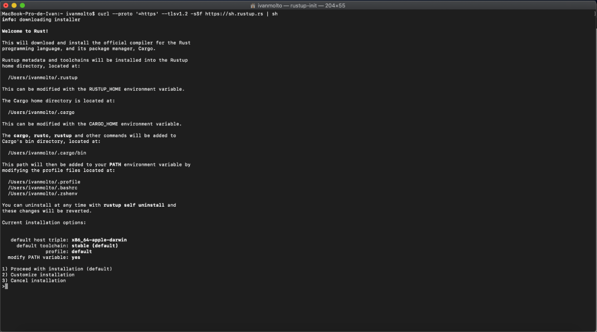
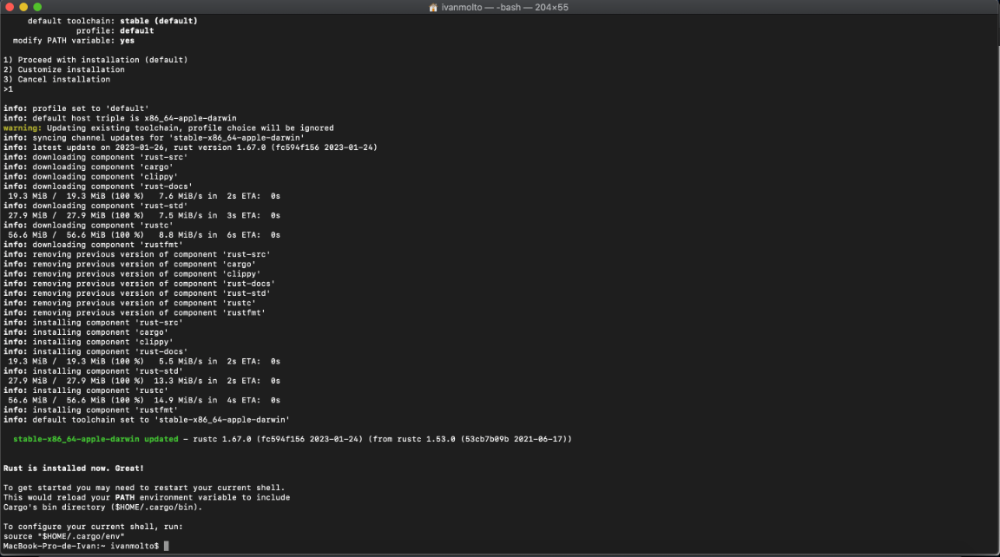
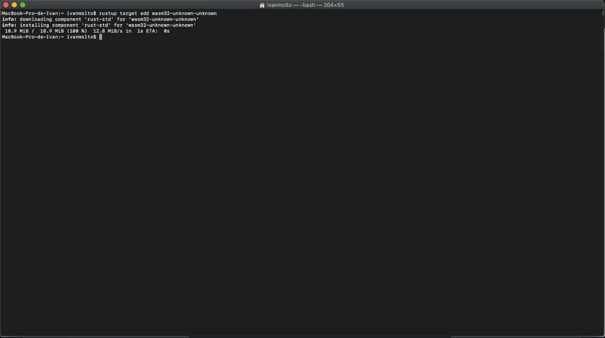
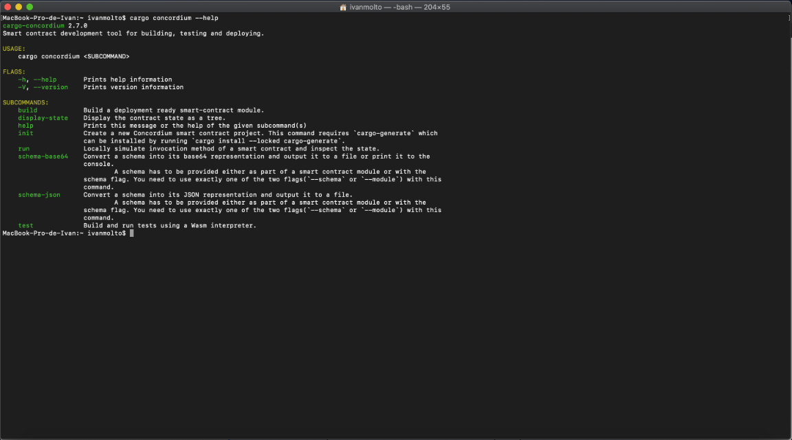
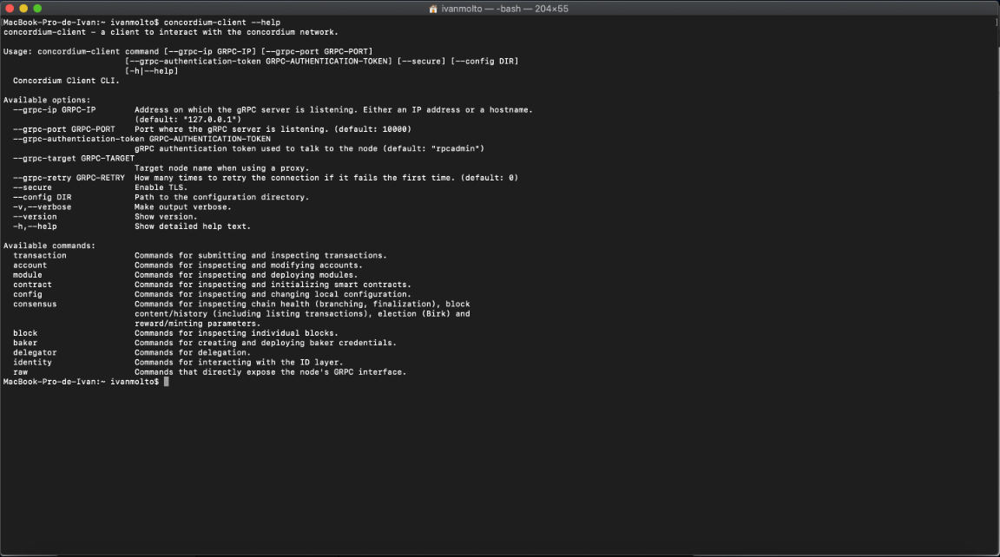
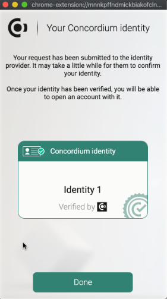
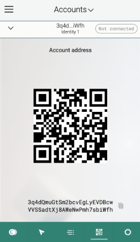
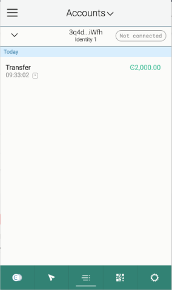
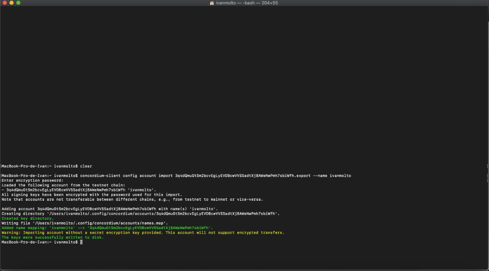

# CONCORDIUM SETUP DEVELOPMENT ENVIRONMENT

Concordium Mainnet address: 3NZdVKXwPzAKQ1a7TnZrcnkGezeAmcQVEYHv4AJuCGeqzBZSMK

Setup development environment for [Concordium](https://concordium.com) Hackathon - The Future of Identity at [Gitcoin](https://gitcoin.co)

## Install Rust and Cargo

First you need to install Rust and Cargo by installing _rustup_

And select 1 to continue.
When Rust and Cargo are successfull installed in the computer, we see this:

Later we install Wasm:

---

## Install cargo-concordium

Now we need to download and install the version 2.7.0 or greater of cargo-concordium.
As everything is correct when entered the command `cargo concordium --help` it shows: 

---

## Install concordium-client

Download and installl concordium-client. As it is all correct we see the image below when checking the installation:

You can connect to the public node with the following command `concordium-client consensus status --grpc-port 10000 --grpc-ip node.testnet.concordium.com` as in the image below:

---

## Install the Web Wallet

We will use the Concordium Wallet for Web which is a chromium-based browser extension. 

## Create a Testnet account 

And create an identity from the Concordium Testnet IP.

---

## Acquiring testnet CCD via the CCD faucet

We use the Tesnet faucet to claim 2000 CCD

---

## Export the account from web wallet and import it into concordium-client

Import the key into the concordium-client configuration by moving your `<YOUR PUBLIC ADDRESS>.export` to the part where we are running the concordium-client tool.

And run in the terminal 
`concordium-client config account import <YOUR PUBLIC ADDRESS>.export --name <Your-Wallet-Name>`

Where <Your-Wallet-Name> is the name that we want to give to the wallet, which is the name
we can use later when interacting with the account through the client.

---

## Concordium Mainnet Address

Concordium Mainnet address: 3NZdVKXwPzAKQ1a7TnZrcnkGezeAmcQVEYHv4AJuCGeqzBZSMK
